# Space Colony

## Origin
I started to have the idea when I was listening to the book series, murder bot. It was inspiring to think about what space travel in the future might be like. Of course, this is not the first book about space travel, the most famous being star wars series. But this one stuck somehow. And I was just thinking about why I liked physics when I was little.

One thing after another, I started to ask LLM what's the most likely space expansion route in the near future. The discussion came out that moon and mars are the most likely next target. Not teraforming, but contained pods on those places. However, another possibility have a big advantage. [O'Neill cylinder](https://en.wikipedia.org/wiki/O%27Neill_cylinder) have the promise to have 1.0 gravity, which have a lot of advantages, from bone density to human developement.

So then I started to ask questions about how possible is the cylinder structure and what we need to build it. I first thought about doing hard calculus and quantum physic classes. But quickly realize that it's mostly for theoretical physics and not going to be rewarding for me to keep going. I probably be better off to make models and solve stuff I know. Think like what condition would human be comfortable living in.

## What It Looks Like

**Standing on the rim surface** — looking up at the curved interior landscape, with window strips letting reflected sunlight pour in:

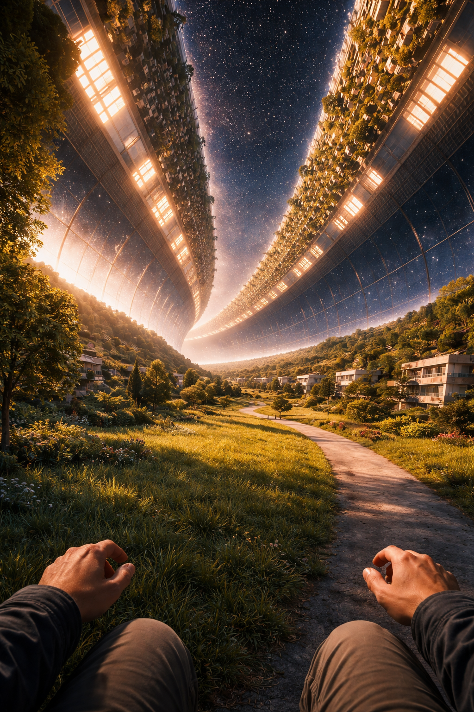

**Looking through a window strip** — external mirrors at 45° redirect axial sunlight into the habitat through the transparent window panels:

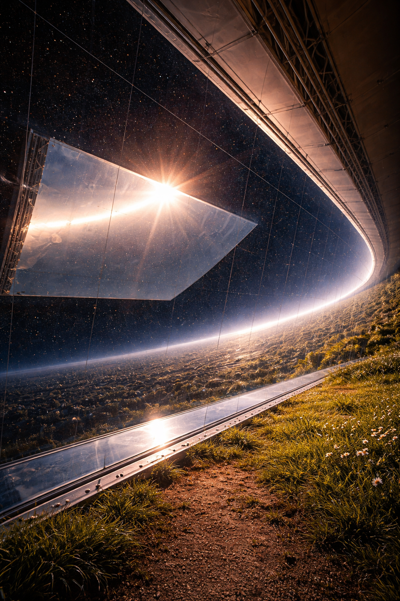

**Looking up from the surface** — the iconic O'Neill view: the opposite land strip curves overhead ~2 km away, with window strips showing space between:


**Floating at the zero-g axis** — weightless at the center, the interior landscape wraps 360° around you, 982 m away in every direction:

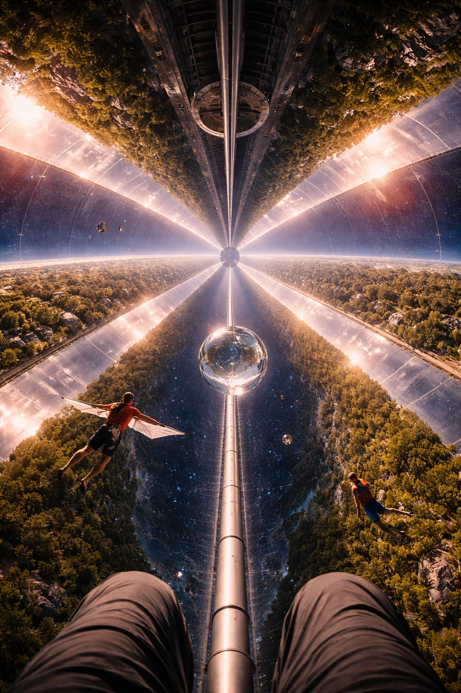

**End cap & docking** — hemispherical end cap with docking port, looking inward along the full 2 km cylinder length:

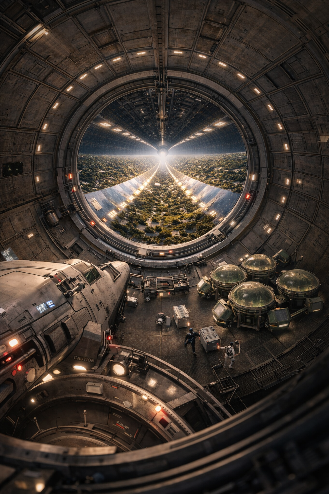

**Mid-zone (0.5g)** — industrial platform at half-radius, half gravity:

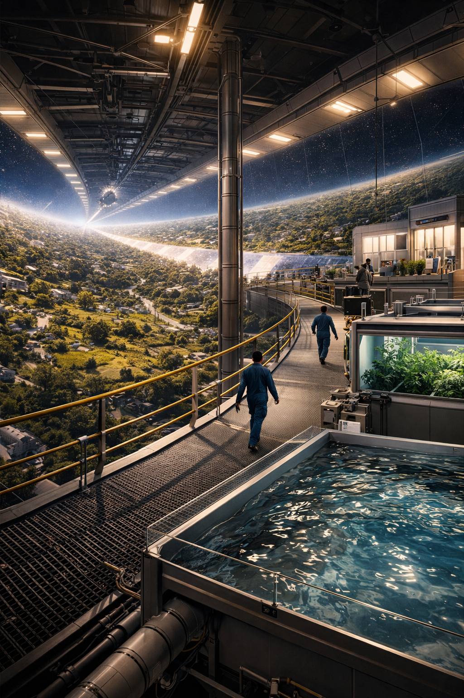

**Exterior view** — counter-rotating cylinder pair in space (note: mirror orientation in this image is not yet accurate — see [07_exterior.md](demo/prompts/07_exterior.md) for corrections):

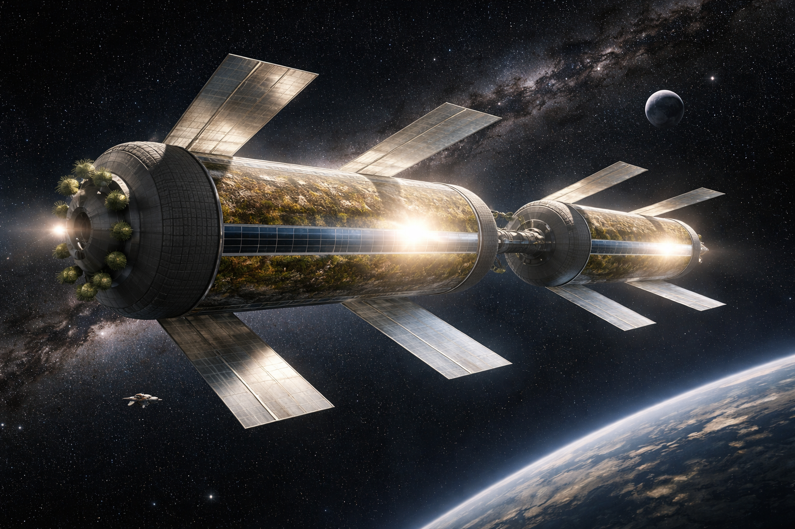

## Goal
This repository deals with practical issues regarding surviving on an O'Neill cylinder, and other issues related to space expansion. The approach is **constraint discovery and sensitivity analysis** — bounding the problem, understanding limits, and reducing unknowns.

## What's Been Done

### 9-Constraint Feasibility Model (Phases 1–5 Complete)

A parametric constraint model that evaluates O'Neill cylinder designs across 9 independent constraints:

**Rotational / Structural:**
1. **Vestibular comfort** — RPM limit (< 2.0 rpm)
2. **Gravity level** — centripetal acceleration (0.3g – 1.0g)
3. **Gravity gradient** — head-to-foot gravity difference (< 1.0%)
4. **Coriolis effect** — lateral force during walking/running (< 25% of g)
5. **Cross-coupling** — vestibular cross-coupled angular acceleration (< 6.0 deg/s²)
6. **Rim speed** — structural hoop stress limit (< 300 m/s)

**Biological / Environmental:**
7. **Radiation shielding** — GCR/SPE attenuation (>= 4,500 kg/m²)
8. **Atmosphere** — partial pressure of oxygen (16–50 kPa)
9. **Population** — minimum viable population for genetic diversity (>= 98)

### Key Results

**Feasible design band at 1g: 982 m – 9,177 m radius**

- Lower bound set by **cross-coupling** (near-zero margin at 982 m)
- Upper bound set by **rim speed** (300 m/s material limit)
- O'Neill reference design (3,200 m) sits comfortably within the band
- Only **2 parameters** actually matter: cross-coupling threshold and head turn rate
- **Radiation shielding is 95% of total mass** (~87 Mt for minimum viable, ~3,331 Mt for O'Neill Island Three)
- Monte Carlo (500 trials): 96.4% feasibility rate, median minimum radius 971 m

### Interactive Demo

A React + Three.js web dashboard for real-time constraint exploration with a counter-rotating O'Neill cylinder pair.

**Main dashboard** — parameter sliders, 9-constraint status panel, feasible region chart, and 3D habitat view:

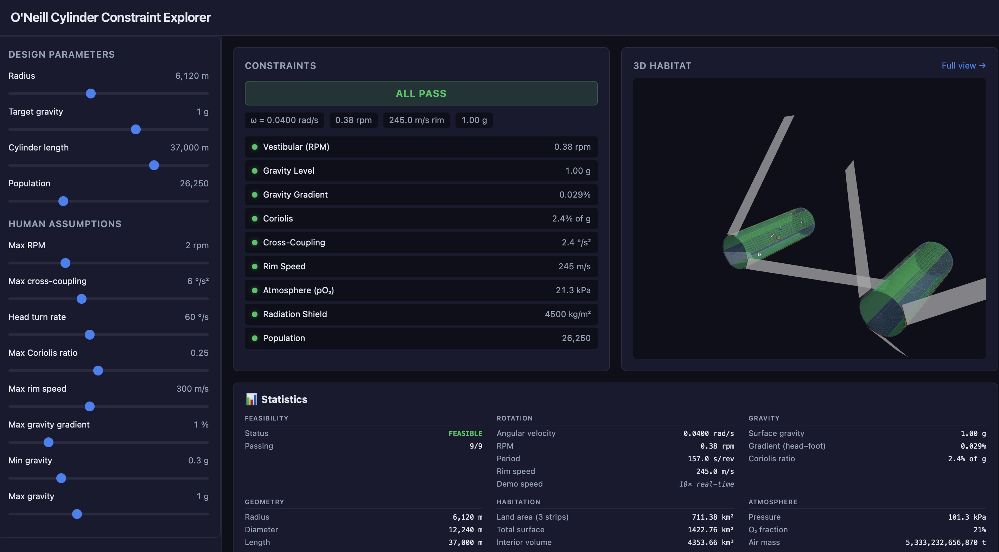

**3D habitat** — counter-rotating cylinder pair with 60° stagger, external mirrors at 45°, hemispherical end caps, land/window strips, agriculture pods, interior zones, tension cables, bearing framework, human figure with Coriolis arrow:

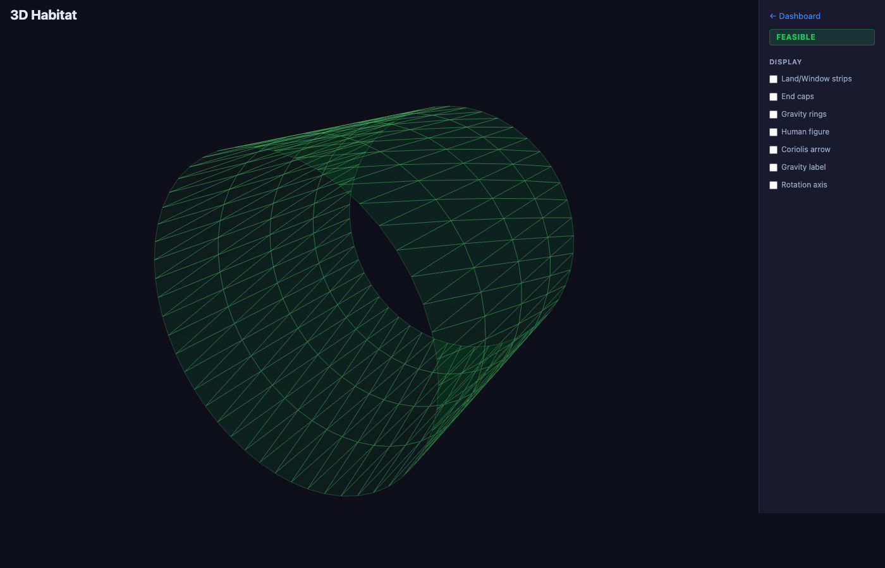

### Analysis Outputs

**Sensitivity tornado chart** — only cross-coupling threshold and head turn rate shift the feasible boundary:

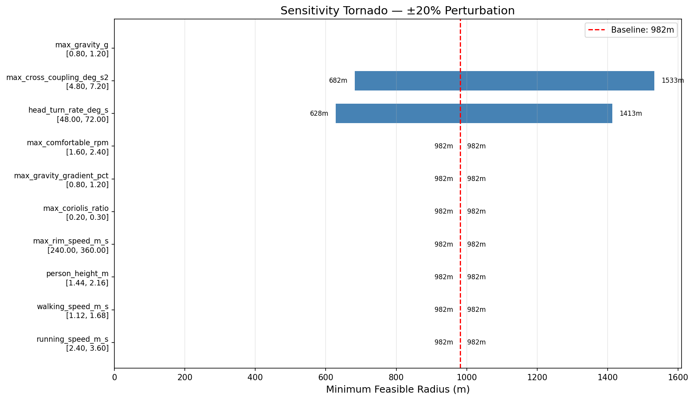

**Feasible region constraint map** — radius vs. gravity with constraint boundaries:

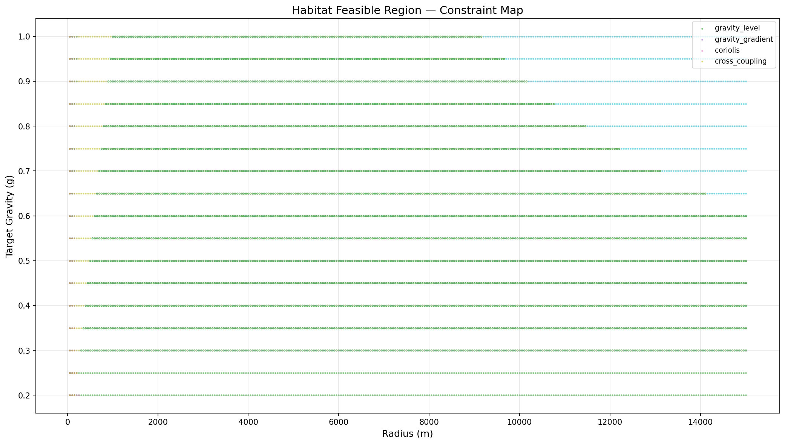

**Monte Carlo histogram** — probability distribution of minimum feasible radius:

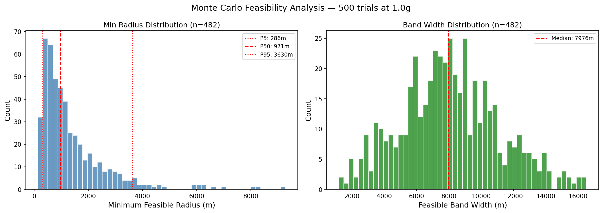

## Folder Structure

* [plans/](plans/) — physics derivations, constraint deep dives, and study plan
  * [space_habitat_study_plan.md](plans/space_habitat_study_plan.md) — study plan with phase tracking (phases 1–5 complete)
  * [issues.md](plans/issues.md) — issues to be solved or managed by models
  * [centripetal_acceleration.md](plans/centripetal_acceleration.md) — centripetal acceleration and simulation of gravity
  * [intuition_angular_velocity.md](plans/intuition_angular_velocity.md) — intuitions of angular velocity
  * [intuition_centripetal_acceleration.md](plans/intuition_centripetal_acceleration.md) — intuitions of centripetal acceleration and derivations
  * [intuition_artificial_gravity.md](plans/intuition_artificial_gravity.md) — how artificial gravity is generated using Newton's second law
  * [general_relativity_and_artificial_gravity.md](plans/general_relativity_and_artificial_gravity.md) — why classical Newton formulas suffice
  * [constraint_vestibular.md](plans/constraint_vestibular.md) — vestibular constraint deep dive, including author's past research with Dr. Thomas A. Houpt
  * [constraint_gravity_gradient.md](plans/constraint_gravity_gradient.md) — gravity gradient (head-to-foot difference); not a limiting constraint
  * [constraint_cross_coupling.md](plans/constraint_cross_coupling.md) — cross-coupling; the most limiting constraint for human comfort
  * [constraint_coriolis.md](plans/constraint_coriolis.md) — Coriolis effects, plus speculations on growing up in curved physics
  * [constraint_gravity_minimum.md](plans/constraint_gravity_minimum.md) — minimum gravity required for habitation; 1g should be the default
  * [constraint_rim_speed.md](plans/constraint_rim_speed.md) — upper limit of cylinder size due to rim speed and structural material limits
  * [constraint_cylinder_length.md](plans/constraint_cylinder_length.md) — length constraint from bending mode resonance
  * [constraint_biological.md](plans/constraint_biological.md) — biological constraints: radiation, atmosphere, population, ecosystem
  * [construction_material_estimates.md](plans/construction_material_estimates.md) — mass budget estimates for minimum viable and O'Neill-scale cylinders
  * [structural_engineering.md](plans/structural_engineering.md) — structural design, materials, counter-rotating pair, mirror constraints
  * [mirror_geometry.md](plans/mirror_geometry.md) — mirror optics: flexible reflective surface, 0–45° tilt, hinge at window center, side-view diagrams, Three.js implementation
  * [draw_mirror_diagram.py](plans/draw_mirror_diagram.py) — generates mirror diagrams (law of reflection, side view, day/night cycle)
  * [interior_space_utilization.md](plans/interior_space_utilization.md) — gravity zones, agriculture area, livable surface
  * [qa_structural_design.md](plans/qa_structural_design.md) — structural quality assurance
* [models/](models/) — parametric constraint model (Python, uv-managed)
  * [habitat_constraints/](models/habitat_constraints/) — 9-constraint feasibility solver
    * [src/habitat_constraints/core/](models/habitat_constraints/src/habitat_constraints/core/) — parameters, constraint protocol, solver
    * [src/habitat_constraints/constraints/](models/habitat_constraints/src/habitat_constraints/constraints/) — 9 constraint implementations
    * [src/habitat_constraints/analysis/](models/habitat_constraints/src/habitat_constraints/analysis/) — sensitivity analysis, Monte Carlo simulation
    * [src/habitat_constraints/visualization/](models/habitat_constraints/src/habitat_constraints/visualization/) — matplotlib plots
    * [src/habitat_constraints/api/](models/habitat_constraints/src/habitat_constraints/api/) — FastAPI backend (port 8042)
    * [experiments/](models/habitat_constraints/experiments/) — phase 1–3 experiment scripts and [output plots](models/habitat_constraints/experiments/output/)
    * [tests/](models/habitat_constraints/tests/) — full pytest suite for all constraints
  * [todos.md](models/todos.md) — list of models to make
* [demo/](demo/) — React + Three.js interactive web dashboard
  * [src/components/CylinderScene.tsx](demo/src/components/CylinderScene.tsx) — main 3D scene (counter-rotating pair, mirrors, strips, interior)
  * [src/lib/sceneGeometry.ts](demo/src/lib/sceneGeometry.ts) — extracted pure geometry/physics functions (testable)
  * [src/__tests__/](demo/src/__tests__/) — 12 vitest test files (106 tests) covering geometry, physics, connectivity
  * [src/components/](demo/src/components/) — ConstraintPanel, ParameterSliders, FeasibleRegionChart, StatsPanel
  * [src/hooks/](demo/src/hooks/) — useDesignParams, useSceneToggles, useConstraintSolver
  * [public/viewpoints/](demo/public/viewpoints/) — AI-generated interior viewpoint images
  * [prompts/](demo/prompts/) — scene prompt files for AI image generation
  * [README.md](demo/README.md) — demo setup instructions and limitations
* [conclusions/](conclusions/) — distilled findings from constraint analysis
  * [001_human_comfort_boundaries.md](conclusions/001_human_comfort_boundaries.md) — Phase 1: minimum radius 224 m (vestibular-dominated)
  * [002_full_constraint_analysis.md](conclusions/002_full_constraint_analysis.md) — Phase 2: feasible band [982 m, 9,177 m] (cross-coupling dominated)
  * [003_biological_constraints_and_monte_carlo.md](conclusions/003_biological_constraints_and_monte_carlo.md) — Phase 3: biological constraints orthogonal, radiation shielding 95% of mass
  * [feasible_habitat_design_space.md](conclusions/feasible_habitat_design_space.md) — comprehensive design space summary across all phases
* [investments/](investments/) — space technology portfolio strategy
  * [space_portfolio_long_horizon_strategy.md](investments/space_portfolio_long_horizon_strategy.md) — long-horizon investment strategy
  * [space_portfolio_abandon_criteria.md](investments/space_portfolio_abandon_criteria.md) — portfolio abandon criteria

## Testing

### 3D Rendering Tests (TypeScript/Vitest)
106 tests across 12 files validate the 3D scene geometry against physics documents:
- **Strip layout** — O'Neill 3+3 alternating pattern, contiguous coverage
- **Mirror geometry** — 45° diagonal via custom BufferGeometry, R_Y(-θ) sign convention
- **Light path physics** — reflection law verification, mirror-to-window alignment
- **Inter-cylinder spacing** — gap formula, no mirror collision with 60° stagger
- **Scene scale** — normalization, length capping
- **Camera presets** — dynamic framing, finite coordinates, correct targets
- **Structural connectivity** — nothing floats in space, all components attached
- **Plans cross-validation** — cross-coupling threshold, rim speed, Coriolis ratio, gravity gradient, feasible band [982m, 9177m]
- **Coordinate system** — R_Y rotation sign, local vs. world transforms
- **Rotation hierarchy** — which components rotate vs. stay static
- **Edge cases** — extreme parameter values

### Pre-commit Hook
Runs automatically on every commit:
1. TypeScript type checking (`tsc --noEmit`)
2. Vitest (12 test files, 106 tests)
3. Python pytest (13 test files, all constraints)

```bash
# Run tests manually
cd demo && npx vitest run          # TypeScript/geometry tests
cd models/habitat_constraints && uv run pytest  # Python/constraint tests
```

## Running the Project

### Constraint Model (Python)
```bash
conda activate space
cd models/habitat_constraints
uv sync --all-extras
uv run pytest                    # run tests
uv run python experiments/run_phase3_analysis.py  # run analysis
```

### Interactive Demo
```bash
# Terminal 1 — API server (port 8042)
conda activate space
cd models/habitat_constraints
uv run uvicorn habitat_constraints.api.main:app --host 127.0.0.1 --port 8042 --reload

# Terminal 2 — Frontend (port 5173)
cd demo
npm install   # first time only
npm run dev
```

Open http://localhost:5173. Both servers must be running. Standalone 3D view at http://localhost:5173/3d.

## What's Next (Phase 6)

Future constraints to extend the model into full systems engineering:
- Thermal management (radiator area vs. waste heat)
- Structural dynamics (vibration modes, seismic equivalent)
- Agriculture area vs. population (food self-sufficiency)
- Water recycling efficiency
- Energy budget (solar panel area, power distribution)

## Limitations
- **Brave Browser**: Three.js 3D rendering does not work correctly in Brave due to Shields/fingerprinting protection. Use Safari or Chrome.
- **Not prediction**: This is constraint discovery and sensitivity analysis, not biological prediction. The model bounds the problem and identifies which assumptions matter most.
