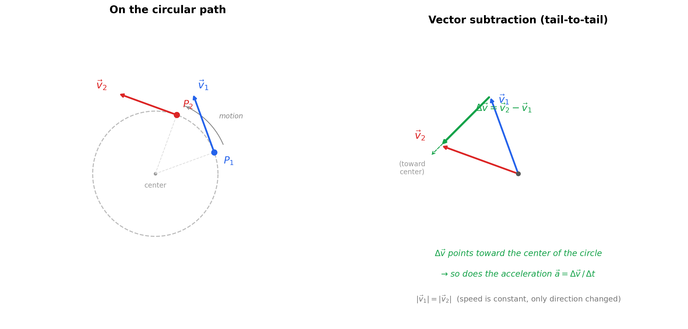

# Centripetal Acceleration: From Intuition to Calculus

---

## 1. What Is Centripetal Acceleration?

An object moving in a circle at constant speed is **accelerating** — not because it's speeding up, but because its **direction is constantly changing**. Velocity is a vector (speed + direction), and any change in that vector, even a pure direction change, counts as acceleration.

Centripetal acceleration is the name for this direction-changing acceleration. It always points **radially inward**, toward the center of the circle. Its magnitude is:

$$
a_c = \frac{v^2}{r} = \omega^2 r
$$

| Symbol   | Meaning                                          | Unit    |
|----------|--------------------------------------------------|---------|
| $a_c$    | Centripetal acceleration                          | m/s²    |
| $v$      | Tangential speed (constant)                       | m/s     |
| $r$      | Radius of circular path                           | m       |
| $\omega$ | Angular velocity                                  | rad/s   |

---

## 2. Why Does It Point Inward? — Vector Subtraction

### The Logic

At time $t_1$, the object has velocity $\vec{v}_1$ (tangent to the circle).
At time $t_2$, the object has velocity $\vec{v}_2$ (tangent to the circle at its new position).

Both vectors have the **same magnitude** $v$ (speed is constant), but they point in **different directions** because the object has moved along the curve.

The change in velocity is:

$$
\Delta \vec{v} = \vec{v}_2 - \vec{v}_1
$$

Acceleration is this change divided by time:

$$
\vec{a} = \frac{\Delta \vec{v}}{\Delta t}
$$

When you place $\vec{v}_1$ and $\vec{v}_2$ tail-to-tail and draw the vector from the tip of $\vec{v}_1$ to the tip of $\vec{v}_2$, that difference vector $\Delta \vec{v}$ points **inward** — toward the center of the circle.

### Diagram: Vector Subtraction Shows Inward Acceleration

**Reading the diagram:**

- **Left:** The object moves from $P_1$ to $P_2$ along the circle. At each point, the velocity arrow is tangent to the circle. Both arrows are the same length (same speed), but point in different directions.
- **Right:** Place both velocity vectors tail-to-tail. The green arrow $\Delta \vec{v} = \vec{v}_2 - \vec{v}_1$ goes from the tip of $\vec{v}_1$ to the tip of $\vec{v}_2$. It points **inward**, toward the center of the circle. Since $\vec{a} = \Delta\vec{v}/\Delta t$, the acceleration also points inward.

---

## 3. Why Not Some Other Direction?

| If acceleration pointed... | What would happen                                    | Consistent with uniform circular motion? |
|----------------------------|------------------------------------------------------|------------------------------------------|
| **Tangentially** (along motion) | Object speeds up or slows down                   | No — speed is constant                   |
| **Outward** (away from center)  | Object spirals away from the circle              | No — radius is constant                  |
| **Inward** (toward center)      | Direction bends without changing speed            | **Yes**                                  |

The inward direction is the **only** direction that bends the trajectory without changing the speed.

---

## 4. Q&A — The Questions You Should Be Asking

### Q: Is centripetal acceleration "how fast the angle changes"?

**Not exactly.** "How fast the angle changes" is angular velocity $\omega$. Centripetal acceleration is how fast the **velocity vector's direction** is changing. Related, but not the same thing. $\omega$ tells you the rotation rate; $a_c = \omega^2 r$ tells you how much acceleration that rotation rate demands at a given radius.

### Q: In $a = v^2/r$, is $v^2$ the tangential acceleration?

**No.** Tangential acceleration means the object is speeding up or slowing down along its path. In uniform circular motion, tangential acceleration is zero — speed is constant. $v^2$ is just speed squared — a scalar quantity. The formula $a_c = v^2/r$ tells you the magnitude of the direction-changing acceleration.

### Q: Why is it $v^2$ and not just $v$? Why does doubling speed quadruple the acceleration?

There are two separate effects when you increase speed, and they **multiply** together.

**Effect 1 — You sweep through angles faster.**

If you're going faster around the circle, your direction changes more rapidly — you rotate through more angle per second. The rate of direction change is proportional to $v$ (since $\omega = v/r$). Doubling $v$ doubles how quickly your velocity vector is rotating.

**Effect 2 — The velocity vector you're rotating is bigger.**

Acceleration isn't just "how fast the direction is changing." It's "how fast the velocity **vector** is changing." A vector has both direction and magnitude. Even if two vectors rotate at the same angular rate, the longer one sweeps out a bigger $\Delta \vec{v}$ per second because its tip covers more distance.

Think of a clock. A short hand and a long hand both complete one revolution per hour (same angular rate). But the tip of the long hand moves through space much faster — because the same angle change, applied to a longer arm, produces a bigger displacement.

So when you double $v$:

- The velocity vector rotates twice as fast (Effect 1: $\times 2$)
- The velocity vector being rotated is twice as long (Effect 2: $\times 2$)
- Total change in velocity per second: $\times 4$

That's $v \times v = v^2$.

**Saying it precisely:**

The magnitude of the change in velocity per unit time is:

$$
a = \underbrace{\omega}_{\text{how fast direction turns}} \times \underbrace{v}_{\text{size of the vector being turned}} = \frac{v}{r} \times v = \frac{v^2}{r}
$$

The first $v$ gets you $\omega$ (how fast the direction turns). The second $v$ is the magnitude of the thing being turned. They multiply.

**Analogy:** Imagine spinning a rope with a ball. If you spin faster, the ball's direction changes more rapidly (it comes around more often), *and* the ball is moving faster at each moment so each direction change involves a bigger velocity being redirected. Both effects scale with speed. Speed shows up twice. Hence $v^2$.

### Q: Why is the acceleration inward if the object is rotating and changing direction all the time?

Because at every single instant, the velocity vector is tangent to the circle, and the *change* in that vector (from one instant to the next) always points toward the center. The object isn't accelerating "around" the circle — it's accelerating **across** its own direction of motion, toward the center, at every moment. That inward pull is what bends the straight-line trajectory into a curve.

Think of it this way: without the inward acceleration, the object flies off in a straight line (Newton's first law). The inward acceleration is what *prevents* straight-line motion and *creates* the circle.

### Q: How does the regular equation connect to the calculus version?

This is answered in detail in Section 5 below. The short answer: the "regular" equations ($v = \omega r$, $a = v^2/r$) give you **magnitudes only**. The calculus version tracks the full vector (magnitude + direction) at every instant, and when you differentiate twice, the inward direction **falls out automatically** via the negative sign.

---

## 5. Bridge: From "Regular" Equations to the Calculus Version

### 5.1 The Setup — Why Parameterize?

The "regular" equations you already know:

$$
v = \omega r, \qquad a_c = \frac{v^2}{r} = \omega^2 r
$$

These give you **magnitudes** — how fast, how much acceleration — but they don't tell you the **direction** at each moment. To prove the acceleration points inward (and not tangentially, or at some angle), we need to track the full position **vector** as a function of time, then differentiate.

### 5.2 Describing Position on a Circle

Put the center of the circle at the origin. At any time $t$, the object is at some angle $\theta$ measured from the positive $x$-axis.

For uniform circular motion, the angle increases at a constant rate:

$$
\theta(t) = \omega t
$$

This is just the definition of constant angular velocity — the angle equals the rate times time.

The object is always at distance $r$ from the origin, at angle $\theta(t)$. Converting from polar to Cartesian (this is just trigonometry, not calculus yet):

$$
x(t) = r\cos\theta(t) = r\cos(\omega t)
$$
$$
y(t) = r\sin\theta(t) = r\sin(\omega t)
$$

Written as a single position vector:

$$
\vec{r}(t) = r\cos(\omega t)\,\hat{x} + r\sin(\omega t)\,\hat{y}
$$

**What this says in plain language:** at time $t$, the object is at the point $(r\cos(\omega t),\; r\sin(\omega t))$. It traces a circle of radius $r$, going around at angular speed $\omega$. This isn't a new equation — it's just the *description* of circular motion in coordinates.

| Piece              | What it means                                           |
|--------------------|---------------------------------------------------------|
| $r$                | Radius — constant, the object stays on the circle       |
| $\cos(\omega t)$   | $x$-component of the unit circle at angle $\omega t$    |
| $\sin(\omega t)$   | $y$-component of the unit circle at angle $\omega t$    |
| $\hat{x}, \hat{y}$ | Unit vectors pointing in the $x$ and $y$ directions     |
| $\omega t$         | The angle at time $t$ (radians), growing at rate $\omega$ |

### 5.3 Step 1 — Velocity: First Derivative of Position

Velocity is "how is position changing with time":

$$
\vec{v}(t) = \frac{d\vec{r}}{dt}
$$

Differentiate each component. The chain rule gives a factor of $\omega$ from the inner function $\omega t$:

$$
\frac{d}{dt}\Big[r\cos(\omega t)\Big] = -r\omega\sin(\omega t)
$$

$$
\frac{d}{dt}\Big[r\sin(\omega t)\Big] = r\omega\cos(\omega t)
$$

So:

$$
\boxed{\vec{v}(t) = -r\omega\sin(\omega t)\,\hat{x} + r\omega\cos(\omega t)\,\hat{y}}
$$

**Checking the magnitude:**

$$
|\vec{v}| = \sqrt{(-r\omega\sin(\omega t))^2 + (r\omega\cos(\omega t))^2} = r\omega\sqrt{\sin^2(\omega t) + \cos^2(\omega t)} = r\omega
$$

We get $|\vec{v}| = r\omega = v$. Constant speed. This matches the "regular" equation $v = \omega r$ — the calculus version just also tells us the direction at each instant.

**Checking the direction:**

$$
\vec{v}(t) \cdot \vec{r}(t) = -r^2\omega\sin(\omega t)\cos(\omega t) + r^2\omega\cos(\omega t)\sin(\omega t) = 0
$$

The dot product is zero → velocity is **perpendicular to the position vector** → tangent to the circle. Exactly what we expect.

### 5.4 Step 2 — Acceleration: Second Derivative of Position

Acceleration is "how is velocity changing with time":

$$
\vec{a}(t) = \frac{d\vec{v}}{dt}
$$

Differentiate each component of $\vec{v}$:

$$
\frac{d}{dt}\Big[-r\omega\sin(\omega t)\Big] = -r\omega^2\cos(\omega t)
$$

$$
\frac{d}{dt}\Big[r\omega\cos(\omega t)\Big] = -r\omega^2\sin(\omega t)
$$

So:

$$
\vec{a}(t) = -r\omega^2\cos(\omega t)\,\hat{x} - r\omega^2\sin(\omega t)\,\hat{y}
$$

Factor:

$$
\boxed{\vec{a}(t) = -\omega^2\Big[r\cos(\omega t)\,\hat{x} + r\sin(\omega t)\,\hat{y}\Big] = -\omega^2\,\vec{r}(t)}
$$

### 5.5 Reading the Result

$$
\vec{a}(t) = -\omega^2\,\vec{r}(t)
$$

- $\vec{r}(t)$ points **outward** (from center to the object).
- The $-$ sign **flips it inward** (from object toward the center).
- $\omega^2$ scales the magnitude.

So the acceleration is:
- **Direction:** radially inward (the negative sign).
- **Magnitude:** $|\vec{a}| = \omega^2 r = v^2/r$ (matches the "regular" formula exactly).
- **Tangential component:** zero. None. The acceleration is purely radial.

### 5.6 Summary: Regular vs. Calculus

| Aspect                    | Regular formula          | Calculus version                                          |
|---------------------------|--------------------------|-----------------------------------------------------------|
| Position                  | Object is on a circle of radius $r$ | $\vec{r}(t) = r\cos(\omega t)\,\hat{x} + r\sin(\omega t)\,\hat{y}$ |
| Speed                     | $v = \omega r$           | $\lvert\vec{v}(t)\rvert = r\omega$ (derived, constant)               |
| Acceleration magnitude    | $a = \omega^2 r = v^2/r$ | $\lvert\vec{a}(t)\rvert = \omega^2 r$ (derived)                      |
| Acceleration direction    | "It points inward" (stated) | $\vec{a} = -\omega^2\vec{r}$ — **inward falls out of the math** |
| Tangential acceleration   | Assumed zero              | **Proven** zero by the derivative                          |

The "regular" equations tell you *what*. The calculus tells you *why* — and proves the direction, rather than just asserting it.
