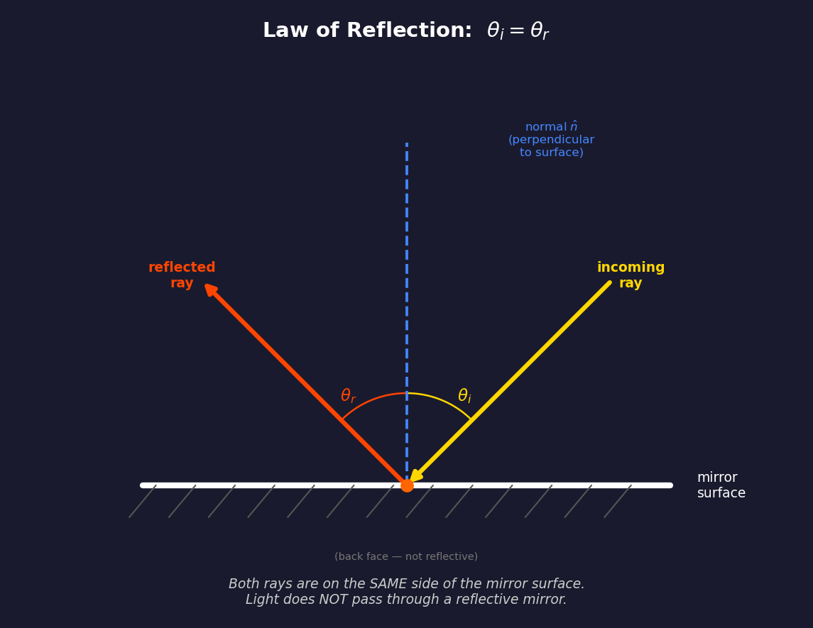
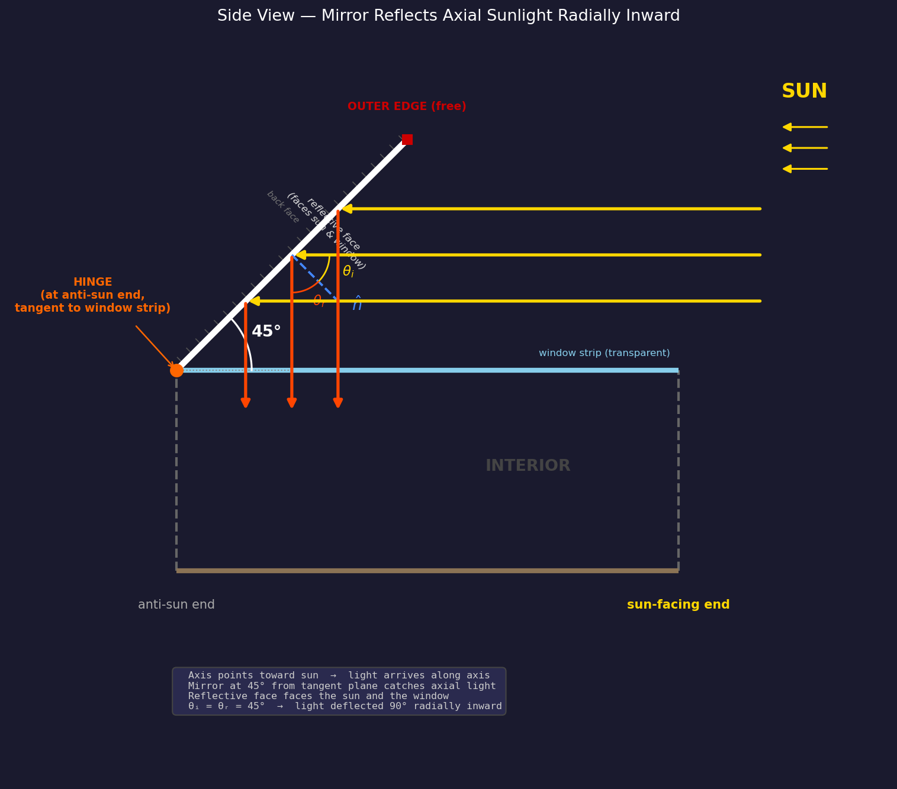
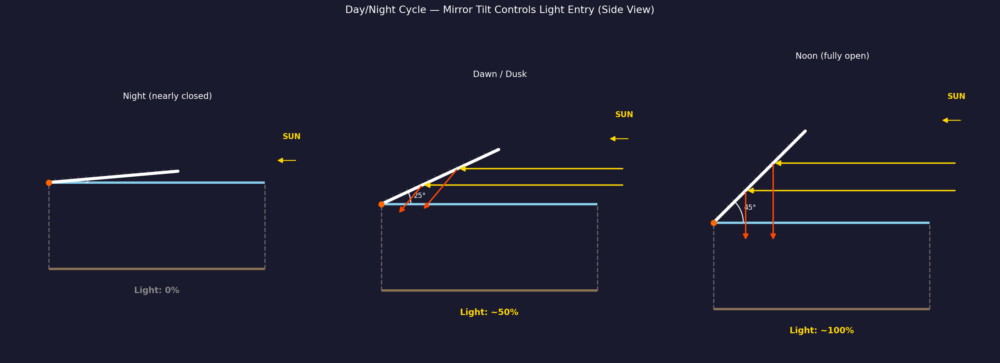

# O'Neill Cylinder External Mirror Geometry

## Purpose

Three large external mirrors reflect sunlight through the window strips into the
cylinder interior, providing illumination to the land strips. Without mirrors,
only direct sunlight through the windows would light the interior. The mirrors
approximately triple the effective capture area.

## Strip Layout (Cross-Section)

Looking from one end of the cylinder, six 60° strips alternate:

```
             Land 2
           (120°–180°)
          /            \
    Window 1            Window 3
   (60°–120°)          (180°–240°)
   |                          |
   Land 0              Land 4
   (0°–60°)            (240°–300°)
          \            /
           Window 5
          (300°–360°)
```

## Law of Reflection



The fundamental physics: when light hits a reflective surface, draw the
**normal** (perpendicular line) at the point of contact. The angle of incidence
$\theta_i$ equals the angle of reflection $\theta_r$, measured from the normal.
**Both rays are on the same side** of the mirror — light does not pass through
a reflective surface.

## Mirror Construction

Each mirror is a **flexible reflective surface** — a large sheet of polished
aluminum or deposited silver on a lightweight substrate. Key properties:

- **One-sided reflection:** Only the outward-facing surface is reflective. The
  back face has thermal management coatings and is not reflective.
- **Light does not pass through the mirror.** The mirror is opaque. Incoming and
  reflected rays are always on the same side (the reflective side).
- **Light does not pass through any other opaque part** of the cylinder system —
  land strips, end caps, structural rings, and the hull are all opaque. Only
  window strips are transparent.

### Hinge Attachment

The mirror is attached to a **hinge** on one of its short sides:

- The hinge runs **tangent to the window strip** at the **center** of the
  window strip (not at the land/window border — see "Why Not Mount at the
  Land/Window Border?" below). It spans the full width of the window strip
  (~$\pi R / 3$, where $R$ is the cylinder radius).
- The hinge is bolted to the **structural end ring** at the **anti-sunlight end**
  of the cylinder ($Y = -L/2$ in the local coordinate system).
- The hinge is a motorized actuator that controls the mirror tilt angle.

### Mirror Dimensions

- **Short side** (tangential, at hinge): equal to window strip width
- **Long side** (diagonal extent): approximately equal to cylinder length $L$
- **Thickness:** thin flexible sheet with structural stiffener ribs on the back
  face, spaced ~50 m apart, to maintain flatness under centrifugal loading

## Mirror Placement — Side View



The cylinder's long axis always points toward the sun. Sunlight arrives
**parallel to the axis**. The mirrors are mounted at the anti-sun end and
tilt diagonally outward to catch this axial light.

### Mirror Angle: 0°–45° from the Tangent Plane

The mirror angle $\alpha$ is measured from the **tangent plane** of the cylinder
surface at the hinge point. The useful range is $0° \leq \alpha \leq 45°$.
In the side view, the tangent plane is the horizontal surface extending along
the axis:

| $\alpha$ | Mirror position | Light behavior |
|-----------|----------------|----------------|
| 0° | Flat along cylinder surface (closed) | No light caught — mirror edge-on to axial light |
| ~25° | Partially open | Some light reflected, enters window at an angle |
| **45°** | **Fully open (maximum)** | **Axial light deflected 90° radially inward** |

There is no reason to tilt beyond 45°. At 45° the reflected light is already
purely radial — the optimal geometry. Tilting further would direct the
reflected beam partially back toward the sun rather than into the window.

### Why 45° is the Maximum

In the side view coordinate system ($+X$ = along axis toward sun,
$+Y$ = radial outward):

The mirror surface direction from the hinge:

$$\hat{m} = (\cos\alpha,\; \sin\alpha)$$

The reflective face normal (perpendicular to mirror, pointing toward the sun
and window):

$$\hat{n} = (\sin\alpha,\; -\cos\alpha)$$

For axial sunlight traveling toward the anti-sun end, $\vec{d} = (-1, 0)$:

$$\vec{d} \cdot \hat{n} = (-1)(\sin\alpha) + (0)(-\cos\alpha) = -\sin\alpha$$

Since $\vec{d} \cdot \hat{n} < 0$ for $0° < \alpha \leq 45°$, the light
correctly hits the reflective face. The reflected ray:

$$\vec{r} = \vec{d} - 2(\vec{d} \cdot \hat{n})\hat{n}$$

At $\alpha = 45°$:

$$\hat{n} = \left(\frac{1}{\sqrt{2}},\; -\frac{1}{\sqrt{2}}\right)$$

$$\vec{r} = \vec{d} - 2(\vec{d} \cdot \hat{n})\hat{n} = (-1, 0) - 2\left(-\frac{1}{\sqrt{2}}\right)\left(\frac{1}{\sqrt{2}},\; -\frac{1}{\sqrt{2}}\right) = (0, -1)$$

The reflected ray is $(0, -1)$ — **purely radially inward** — which passes
straight through the window strip into the interior. This is the maximum
useful tilt angle.

### Three Mirrors

Three mirrors, one per window strip, each hinged at the **center** of its
window strip:

| Mirror | Window strip | Hinge angle (center) |
|--------|-------------|---------------------|
| Mirror 1 | Window 1 (60°–120°) | 90° |
| Mirror 2 | Window 3 (180°–240°) | 210° |
| Mirror 3 | Window 5 (300°–360°) | 330° |

## Day/Night Cycle



The mirror tilt angle $\alpha$ (from the tangent plane) controls the simulated
day/night cycle:

| Mirror state | Tilt $\alpha$ | Light throughput | Simulated time |
|-------------|---------------|-----------------|----------------|
| Nearly closed | ~5° | 0% | Night |
| Partially open | ~25° | ~50% | Dawn / Dusk |
| Fully open | 45° | ~100% | Noon |

All three mirrors open and close **symmetrically** to avoid unbalanced torque
on the cylinder.

**Day/night is controlled entirely by the mirror tilt**, not by the cylinder's
rotation. The transition speed between tilt angles controls dawn/dusk duration.

## Why Not Mount at the Land/Window Border?

The first idea for mirror placement is intuitive: hinge the mirror at the
**border** between a land strip and a window strip (e.g., at 120°, where
Window 1 meets Land 2). The mirror opens like a door from the edge, covering
the window from one side.

This has two problems:

**1. Off-center illumination.** The reflected light enters the window at an
angle from the edge, not centered. One side of the window strip receives
concentrated light while the far side receives little. Residents would see
a bright band on one side of the land strip and shadow on the other.

**2. The strobing problem.** If the sun shines perpendicular to the cylinder
axis (the naive orientation), only the mirrors on the sun-facing side catch
light. As the cylinder rotates at ~1 RPM, each window strip faces the sun
for only ~10 seconds out of every 63-second rotation. Residents would
experience a disorienting ~1 Hz light flicker that no mirror arrangement at
the border could eliminate — because the root cause is geometric, not about
mirror placement.

Both problems are solved by O'Neill's design:

## Constant Illumination — Axis Points at the Sun

**O'Neill's solution: point the cylinder's long axis toward the sun, and
mount each mirror at the center of its window strip.**

Mounting at the **window center** (90°, 210°, 330°) instead of the border
means reflected light enters the window symmetrically, illuminating the
adjacent land strips evenly on both sides.

Pointing the **axis toward the sun** eliminates strobing entirely:
- Sunlight arrives **parallel to the rotation axis**, not perpendicular to it
- As the cylinder rotates, the mirrors maintain the **same orientation** relative
  to the sun (because rotating around the sun-axis doesn't change the geometry)
- All three mirrors receive **constant, equal illumination** at all times
- No strobing, no periodic variation — steady daylight

This is why the mirrors must be **diagonal** (tilted from the tangent plane).
Axial sunlight cannot be caught by mirrors flat along the surface — they would
be edge-on to the light. The tilt intercepts the axial beam and deflects it
radially inward through the windows.

## How the Outer Edge Stays in Place

The mirror's outer edge is **free** — it has no mechanical attachment to any
external structure. This is counterintuitive, but the mirror is inherently
stable due to the physics of the rotating system:

### 1. Centrifugal force holds the mirror open

The cylinder rotates at $\omega \approx 0.1$ rad/s. Every point on the
co-rotating mirror experiences centrifugal acceleration:

$$a_{cf} = \omega^2 r$$

where $r$ is the distance from the rotation axis. The outer edge of the mirror
is at a **larger radius** than the hinge, so centrifugal force pulls it
**outward** (away from the axis). This force acts like gravity pulling the
mirror into its open position.

**Key insight:** Centrifugal force **helps** hold the mirror open — it doesn't
try to close it. The hinge actuator must apply torque to **close** the mirror
against centrifugal force, not to keep it open.

### 2. No aerodynamic forces

In vacuum, there is no wind loading, no flutter from airflow, and no turbulence.
The only forces on the mirror are:

- Centrifugal force (outward) — stabilizing when open
- Solar radiation pressure ($\sim 9 \times 10^{-6}$ N/m²) — negligible
- Thermal expansion from solar heating — managed by expansion joints
- Hinge actuator torque — controls the opening angle

### 3. Structural stiffener ribs prevent buckling

The mirror panel has a lattice of lightweight I-beam ribs (aluminum or carbon
fiber) on the back face, spaced ~50 m apart. These ribs:

- Maintain flatness against centrifugal loading
- Prevent buckling modes from thermal cycling
- Distribute hinge loads across the full panel width

The mirror is structurally similar to an aircraft wing spar — rigid, lightweight,
and engineered to resist bending.

### 4. No resonance excitation

Because the mirror **co-rotates** with the cylinder, it sits in a constant
centrifugal field (like sitting in constant gravity). There are no periodic
forces to excite vibration. The system is inherently stable.

### 5. What if the mirror were NOT co-rotating?

If the mirror were stationary while the cylinder rotates beneath it, it would:

- Experience no centrifugal force (it's in freefall)
- Need an independent support structure
- Flash alternating sunlight/shadow strips as the cylinder rotates underneath
- Be far more complex to engineer

This is why O'Neill's design has the mirrors **rigidly attached** to the hull
and co-rotating. The rotating reference frame makes the mirror behave like a
simple hinged panel in a gravitational field.

## Inter-Cylinder Spacing Constraint

The counter-rotating pair must be spaced far enough apart that the mirrors of
one cylinder do not collide with the other cylinder or its mirrors. This
creates a **geometric constraint** that couples cylinder length $L$ to the
minimum center-to-center separation $S$.

### The Constraint

At 45° tilt, each mirror's radial extent (perpendicular to the axis) equals
its axial extent:

$$d_{\text{radial}} = d_{\text{axial}} = L$$

The outer tip of a mirror on cylinder A is at distance $R + L$ from A's axis.
For clearance from cylinder B (radius $R$), the center-to-center spacing must
satisfy:

$$S > 2R + 2L$$

or equivalently, the gap between the cylinder surfaces:

$$\text{gap} > 2L$$

For a cylinder with $R = 1\,\text{km}$ and $L = 32\,\text{km}$ (O'Neill's
original dimensions), the minimum separation is $S > 2 + 64 = 66\,\text{km}$.
This is a **hard structural constraint** — the bearing framework connecting
the pair must span this distance.

### Mitigation Strategies

Three approaches can relax this spacing constraint:

**1. Staggered mirror orientation (60° rotational offset)**

If the two cylinders have their strip patterns offset by one strip width
(60°), each cylinder's mirrors point into the gaps between the other's
mirrors. In the cross-section end view:

```
    Cylinder A mirrors at:  90°, 210°, 330°  (window centers)
    Cylinder B mirrors at: 150°, 270°,  30°  (offset by 60°)
```

The mirror fans interleave rather than overlap head-on. This reduces the
worst-case radial overlap and allows closer spacing — roughly:

$$S_{\text{staggered}} > 2R + 2L \sin(30°) = 2R + L$$

A factor-of-two improvement. In the 3D model, this is achieved by rotating
the second cylinder's strip pattern by $\pi/3$ relative to the first.

**2. Shorter mirrors (reduced tilt angle)**

A tilt angle $\alpha < 45°$ reduces the radial extent to
$d_{\text{radial}} = L \sin(\alpha)$ while the axial extent becomes
$L \cos(\alpha)$. The tradeoff: the reflected light is no longer purely
radial — it acquires an axial component, reducing illumination efficiency.

At $\alpha = 30°$: $d_{\text{radial}} = L \sin(30°) = 0.5L$, cutting
radial extent by 50%. The reflected beam enters at an angle to the radial
direction rather than straight through the window, but still provides
useful illumination.

**3. Segmented mirrors**

Instead of one continuous surface per window strip, use multiple shorter
segments at 45° arranged in a staircase pattern along the cylinder length.
Each segment is shorter (less radial extent) but the segments collectively
cover the full window area. This is structurally more complex but
dramatically reduces the radial envelope.

### Length as a Design Parameter

When cylinder length $L$ is a free parameter (as in the interactive demo),
the inter-cylinder gap **must scale with** $L$:

$$\text{gap}(L) = 2L + R \quad \text{(with safety margin)}$$

This means longer cylinders require proportionally wider separation. The
bearing framework, tension cables, and any shared infrastructure between
the pair all scale with this distance, increasing structural mass. This
creates an **implicit upper bound on useful cylinder length** — beyond a
certain $L$, the framework mass to span the gap becomes prohibitive.

## Three.js Implementation

### Coordinate System (inside the `rotation={[-PI/2, 0, 0]}` group)

- **Y** = cylinder long axis (rotation axis), sun at +Y end
- **XZ** = radial cross-section plane
- Point on rim at angle $\theta$: `[cos(θ) × R, 0, sin(θ) × R]`
- Radial outward at angle $\theta$: direction `[cos(θ), 0, sin(θ)]`

### Mirror Construction — Custom BufferGeometry

Each mirror is built as an explicit quad with four vertices — **no Euler
rotations on the mesh**. This avoids the compounding rotation errors that
plagued earlier implementations (see `CLAUDE.md` for lessons learned).

For each window strip $i$ (strips 1, 3, 5):

1. **Center angle** of the window strip:
   - $\theta_c = \frac{\pi}{3}(2i + 1) + \frac{\pi}{6}$ → gives
     $\frac{\pi}{2}$, $\frac{7\pi}{6}$, $\frac{11\pi}{6}$ (90°, 210°, 330°)

2. **Group position** = hinge point at the anti-sun end, on the cylinder
   surface at the window center:
   - `[cos(θ_c) × R, -length/2, sin(θ_c) × R]`

3. **Group rotation** = `[0, -θ_c, 0]` which establishes local axes:
   - `+X` = radial outward (verified: $R_Y(-\theta)$ maps $+X$ to
     $(\cos\theta, 0, \sin\theta)$)
   - `+Y` = axial toward sun
   - `+Z` = tangential

4. **Mirror quad** = custom `BufferGeometry` with four vertices in
   group-local coordinates:
   ```
   Inner edge (at hinge):  (0, 0, -t)  and  (0, 0, +t)
   Outer edge (diagonal):  (d, d, -t)  and  (d, d, +t)
   ```
   where $d$ = `mirrorAxialExtent` (= cylinder length) and
   $t$ = `mirrorTangent / 2` (half the window strip width).

   The 45° diagonal is encoded directly in the vertex positions: the outer
   edge is at $(d, d)$ — equal parts radial ($+X$) and axial ($+Y$). No
   mesh-level rotation is needed.

5. **Hinge rod** = `cylinderGeometry` at the group origin, rotated to lie
   along the tangential direction ($Z$), spanning the same width as the
   mirror's inner edge.

### Why Custom Geometry, Not Euler Rotations

Euler rotations on `planeGeometry` failed repeatedly because:

- $R_Y(\alpha)$ maps $+X \to (\cos\alpha, 0, -\sin\alpha)$ — the sign of the
  $Z$ component is **opposite** to what intuition suggests. Using $+\theta$
  instead of $-\theta$ sends the mirror radially inward.
- Compound rotations (group + mesh) create 6 interacting angle parameters
  with no visual ground truth in a space scene.
- Custom vertices eliminate all rotation ambiguity: `(d, d, ±t)` is
  unambiguously at 45° outward and sunward.

### Inter-Cylinder Gap (Dynamic)

The `CounterRotatingPair` component computes the gap dynamically:

```
mirrorRadialExtent = length
gap = mirrorRadialExtent × 2 + radius
sideOffset = radius × 2 + gap
```

This ensures mirrors never collide regardless of the cylinder length
parameter.

### Reflection Verification

With incoming axial light $\vec{d} = (0, -1, 0)$ and mirror normal
$\hat{n} = (-0.707, 0.707, 0)$:

$$\vec{r} = \vec{d} - 2(\vec{d} \cdot \hat{n})\hat{n} = (0,-1,0) - 2(-0.707)(-0.707, 0.707, 0) = (-1, 0, 0)$$

Reflected light goes radially inward ($-\hat{X}$) — through the window ✓

## References

O'Neill, Gerard K. *The High Frontier: Human Colonies in Space.* William Morrow, 1977.

Johnson, Richard D., and Charles Holbrow, editors. *Space Settlements: A Design Study (SP-413).* NASA, 1977.
